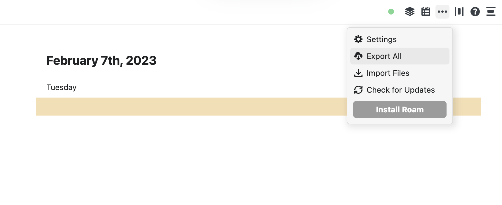
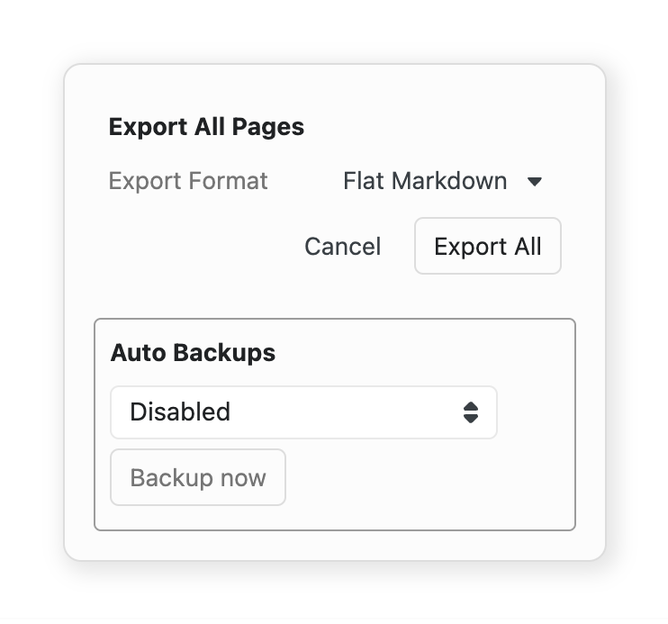

# Roam Research Question-Answering

🤖Ask questions to your Roam Research graph in natural language🤖

💪 Built with [LangChain](https://github.com/hwchase17/langchain)

🤯 Inspired by [hwchase17/notion-qa](https://github.com/hwchase17/notion-qa) 

# 🌲 Environment Setup

In order to set your environment up to run the code here, first install all requirements:

```shell
pip install -r requirements.txt
```

Then set your OpenAI API key (if you don't have one, get one [here](https://beta.openai.com/playground))

```shell
export OPENAI_API_KEY=....
```

# 📄 What is in here?
- Example data from Blendle 
- Python script to query Roam Graph with a question
- Code to deploy on StreamLit
- Instructions for ingesting your own dataset

## 📊 Example Data
This repo uses the [Roam Help Graph](https://roamresearch.com/#/app/help) as an example.
It was downloaded at [[February 7, 2023]] so may have changed slightly since then!

## 💬 Ask a question
In order to ask a question, run a command like:

```shell
python qa.py "What is the work from home policy"
```

You can switch out `What is the work from home policy` for any question of your liking!

This exposes a chat interface for interacting with a Roam Research graph.
IMO, this is a more natural and convenient interface for getting information.

## 🚀 Code to deploy on StreamLit

The code to run the StreamLit app is in `main.py`. 
Note that when setting up your StreamLit app you should make sure to add `OPENAI_API_KEY` as a secret environment variable.

## 🧑 Instructions for ingesting your own dataset

Export your dataset from Roam Research. You can do this by clicking on the three dots in the upper right hand corner and then clicking `Export`.



When exporting, make sure to select the `Markdown & CSV` format option.



This will produce a `.zip` file in your Downloads folder. Move the `.zip` file into this repository.

Run the following command to unzip the zip file (replace the `Export...` with your own file name as needed).

```shell
unzip Roam-Export-1675782732639.zip -d Roam_DB
```

Run the following command to ingest the data.

```shell
python ingest.py
```

Boom! Now you're done, and you can ask it questions like:

```shell
python qa.py "What is the work from home policy"
```
